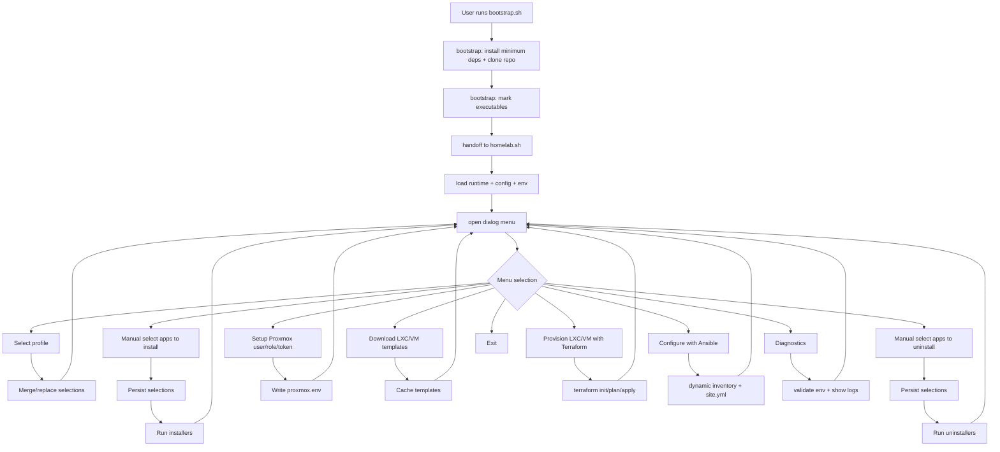

# Architecture – fouchger_homelab

## Purpose
This document is the authoritative architecture reference for the **fouchger_homelab** project. It explains structure, control flow, contracts, and diagrams. It is intended for contributors extending the menu, adding applications, or evolving Proxmox, Terraform, or Ansible workflows.

Design intent: predictable, replayable automation with a consistent UI and strong guardrails to avoid partial runs.

## Expanded structure
```text
fouchger_homelab
├── 📁 archieve  (legacy, non-executed)
├── 📁 commands
│   ├── 📄 ansible_apply.sh
│   ├── 📄 apps_install.sh
│   ├── 📄 apps_uninstall.sh
│   ├── 📄 cleanup.sh
│   ├── 📄 diagnostics.sh
│   ├── 📄 menu.sh
│   ├── 📄 profiles.sh
│   ├── 📄 proxmox_access.sh
│   ├── 📄 selections.sh
│   ├── 📄 templates.sh
│   └── 📄 terraform_apply.sh
├── 📁 config
│   ├── ⚙️ apps.yml
│   ├── 📄 executables.list
│   ├── ⚙️ profiles.yml
│   ├── 📄 proxmox.env.example
│   ├── 📄 secrets.env.example
│   ├── ⚙️ settings.env
│   ├── ⚙️ ui.yml
│   └── ⚙️ validations.yml
├── 📁 docs
│   ├── 📁 ADRs
│   │   ├── 📝 0001-architecture-and-state-contract.md
│   │   ├── 📝 0002-dry-run-and-replay.md
│   │   └── 📝 0003-validation-gates.md
│   ├── 📁 developers
│   │   ├── 📝 architecture.md
│   │   ├── 📝 extending.md
│   │   ├── 📝 runtime.md
│   │   └── 📝 validation-and-errors.md
│   ├── 📁 runbooks
│   ├── 📁 specs
│   │   ├── 📝 00-index.md
│   │   ├── 📝 01-functional-overview.md
│   │   ├── 📝 02-config-and-state-schema.md
│   │   ├── 📝 03-ui-and-navigation-spec.md
│   │   ├── 📝 04-bootstrap-spec.md
│   │   ├── 📝 05-menu-and-command-contracts.md
│   │   ├── 📝 06-apps-pipeline-spec.md
│   │   ├── 📝 07-proxmox-access-spec.md
│   │   ├── 📝 08-templates-spec.md
│   │   ├── 📝 09-terraform-spec.md
│   │   ├── 📝 10-ansible-spec.md
│   │   ├── 📝 11-diagnostics-and-cleanup-spec.md
│   │   ├── 📝 12-dry-run-and-replay-spec.md
│   │   ├── 📝 13-logging-observability-spec.md
│   │   ├── 📝 14-validation-gates-spec.md
│   │   ├── 📝 15-security-and-secrets-spec.md
│   │   └── 📝 16-acceptance-tests.md
│   ├── 📁 users
│   ├── 📝 README.md
│   └── 📄 design document
├── 📁 lib
│   ├── 📄 common.sh
│   ├── 📄 config.sh
│   ├── 📄 env.sh
│   ├── 📄 logger.sh
│   ├── 📄 runtime.sh
│   ├── 📄 ui_dialog.sh
│   └── 📄 validation.sh
├── 📁 modules
│   └── 📁 apps
│       ├── 📁 install
│       │   └── 📄 docker.sh
│       └── 📁 uninstall
│           └── 📄 docker.sh
├── 📁 proxmox
│   ├── 📁 ansible
│   │   ├── 📁 inventory
│   │   │   ├── ⚙️ hosts.yml
│   │   │   └── ⚙️ proxmox_dynamic.yml
│   │   ├── 📁 playbooks
│   │   │   ├── ⚙️ base.yml
│   │   │   ├── ⚙️ k8s_talos.yml
│   │   │   └── ⚙️ site.yml
│   │   ├── 📁 roles
│   │   │   ├── 📁 common
│   │   │   ├── 📁 docker
│   │   │   ├── 📁 hardening
│   │   │   └── 📁 monitoring
│   │   └── 📄 ansible.cfg
│   ├── 📁 terraform
│   │   ├── 📁 modules
│   │   │   ├── 📁 lxc
│   │   │   └── 📁 vm
│   │   ├── 📄 main.tf
│   │   ├── 📄 outputs.tf
│   │   ├── 📄 providers.tf
│   │   ├── 📄 variables.tf
│   │   └── 📄 versions.tf
│   ├── 📄 download_templates.sh
│   └── 📄 setup_access.sh
├── 📁 state
│   ├── 📁 logs
│   ├── 📁 runs
│   │   └── ⚙️ latest.env
│   ├── ⚙️ proxmox.env
│   ├── ⚙️ secrets.env
│   └── ⚙️ selections.env
├── ⚙️ .gitignore
├── 📄 LICENSE
├── 📝 README.md
├── 📄 VERSION
├── 📄 install.sh
├── 📄 bootstrap.sh
└── 📄 homelab.sh
```


## UI layer
The UI layer is deliberately split into two tiers.

Tier 1 is **UI plumbing**, implemented in `lib/ui_dialog.sh`. This tier covers deterministic UI mode selection (dialog via `/dev/tty`, text prompts when interactive, otherwise headless defaults), non-interactive fallbacks, and consistent message presentation.

Tier 2 is the **UI helper API** (for example `ui_info`, `ui_warn`, `ui_error`). This helper API is **not considered stable in Sprint 1**. Entry points may reference helper functions ahead of formal definition and, if so, a controlled error is acceptable provided the runtime lifecycle still completes (log, summary, validation, and clean exit reporting).

Sprint 2 formalises the helper API so commands and menu flows can depend on it without ambiguity.

## Legacy archive directory
`archieve/` is intentionally kept as legacy reference material only. It is not
part of the live execution path and must not be sourced, executed, or referenced
by new code.

Guardrails:
- `bootstrap.sh` intentionally skips `archieve/` when setting executable bits.
- New features must land under `lib/`, `commands/`, `modules/`, or `proxmox/`.
- If we later decide to remove the archive, we should do it as a dedicated
  cleanup change with a release note.

## Notes on what’s new and why
- **lib** is the shared plumbing (UI, logging, env handling, validation), so every command behaves consistently.
- **commands** is the contract: one file per menu action. homelab.sh routes to these.
- **state/cache** and **state/runs** keep artefacts tidy and avoid re-downloading templates or re-initialising Terraform unnecessarily.
- **config/validations.yml** and **config/ui.yml** keep rules and UI behaviour declarative, so extending the menu doesn’t turn into bash spaghetti.

## Project flow diagram with file references


## Diagram to file mapping
- A: bootstrap.sh
- B: bootstrap.sh, lib/runtime.sh, lib/common.sh
- C: config/executables.list, lib/validation.sh (optional checks), bootstrap.sh
- D: homelab.sh
- E: lib/runtime.sh, lib/config.sh, lib/env.sh, lib/logger.sh, config/settings.env, state/proxmox.env, state/secrets.env
- F: commands/menu.sh, lib/ui_dialog.sh, config/ui.yml
- H1: commands/profiles.sh, config/profiles.yml, config/apps.yml
- I1: commands/selections.sh, state/selections.env, lib/config.sh
- H2: commands/apps_install.sh, commands/selections.sh, config/apps.yml
- J2: modules/apps/install/*.sh, lib/common.sh, lib/logger.sh
- H3: commands/apps_uninstall.sh, commands/selections.sh, config/apps.yml
- J3: modules/apps/uninstall/*.sh, lib/common.sh, lib/logger.sh
- H4: commands/proxmox_access.sh, proxmox/setup_access.sh, config/proxmox.env.example, state/proxmox.env
- H5: commands/templates.sh, proxmox/download_templates.sh, state/cache/templates
- H6: commands/terraform_apply.sh, proxmox/terraform/*, state/cache/terraform, state/logs
- H7: commands/ansible_apply.sh, proxmox/ansible/inventory/, proxmox/ansible/playbooks/site.yml, proxmox/ansible/roles/
- H8: commands/diagnostics.sh, lib/validation.sh, config/validations.yml, state/logs

## Required for every function baseline
Every command in `commands/` should source the same core set so behaviour is uniform:
- lib/runtime.sh (paths, OS detection, dependency checks, run context)
- lib/logger.sh (structured logs to state/logs, plus console output)
- lib/ui_dialog.sh (dialog wrappers, standard colours, window sizing)
- lib/env.sh (load state/proxmox.env, state/secrets.env, config/settings.env safely)
- lib/config.sh (read config/apps.yml and config/profiles.yml consistently)
- lib/validation.sh (pre-flight checks based on config/validations.yml)

## Function reference (menu option to implementation)
### Select profile (basic, development, network admin, proxmox admin)
- UI and routing: commands/menu.sh, lib/ui_dialog.sh
- Profile definitions: config/profiles.yml
- App catalogue and metadata: config/apps.yml
- Merge/replace logic and persistence: commands/profiles.sh, commands/selections.sh, state/selections.env

### Manual select apps to install or uninstall
- UI and selection: commands/apps_install.sh, commands/apps_uninstall.sh
- Execution: modules/apps/install/<app>.sh and modules/apps/uninstall/<app>.sh
- Logging: lib/logger.sh to state/logs

### Setup Proxmox user, role, token
- Menu handler: commands/proxmox_access.sh
- Proxmox script: proxmox/setup_access.sh
- Output env: state/proxmox.env (seeded from config/proxmox.env.example)

### Download Proxmox LXC/VM templates (Ubuntu 22+ and latest Talos)
- Menu handler: commands/templates.sh
- Downloader: proxmox/download_templates.sh
- Cache: state/cache/templates

### Setup LXC/VM using Terraform
- Menu handler: commands/terraform_apply.sh
- Terraform code: proxmox/terraform/*
- Terraform working/cache: state/cache/terraform
- Outputs passed forward: state/runs/latest.env (and a generated outputs file)

### Configure LXC/VM using Ansible
- Menu handler: commands/ansible_apply.sh
- Inventory: proxmox/ansible/inventory/hosts.yml and proxmox_dynamic.yml
- Playbooks: proxmox/ansible/playbooks/site.yml
- Roles: proxmox/ansible/roles/*
