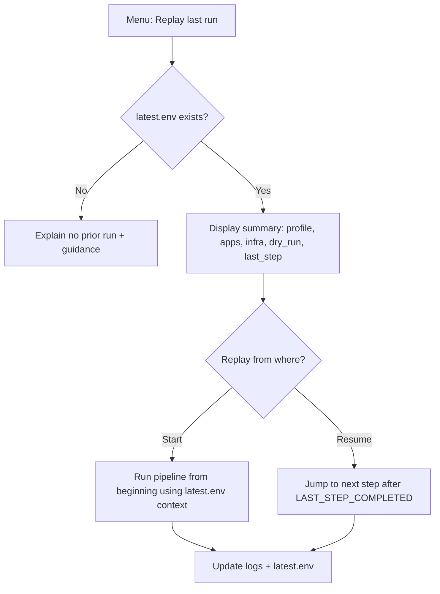

# Runtime – dry run, replay, and handoff contracts

## Purpose
This document defines the runtime contracts that make runs predictable, recoverable, and safe:
- dry run behaviour
- replay and resume behaviour
- cross-step handoff via state/runs/latest.env
- step publication requirements

## config/settings.env keys
- **dry_run=true|false**
  Default false. When true, no changes are applied. Commands must only validate, preview actions, and write a report.

- **replay_enabled=true|false**
  Default true. Enables “Replay last run”.

## state/runs/latest.env contract
Purpose: single source of truth for the latest successful or in-progress run. Used for replay, resume, and cross-tool handoffs.

Recommended contents (non-secret only):
- RUN_ID, RUN_TIMESTAMP
- DRY_RUN (true|false)
- SELECTED_PROFILE (if any)
- SELECTED_APPS_INSTALL (comma list)
- SELECTED_APPS_UNINSTALL (comma list)
- PROXMOX_API_URL, PROXMOX_NODE, PROXMOX_TOKEN_ID (non-secret identifiers only)
- TEMPLATE_UBUNTU_IMAGE, TEMPLATE_TALOS_IMAGE (paths or IDs)
- TERRAFORM_WORKDIR, TFSTATE_PATH
- TERRAFORM_OUTPUT_JSON (path to a generated outputs file)
- ANSIBLE_INVENTORY_PATH
- LAST_STEP_COMPLETED (for replay and resume)

Security note: latest.env must not store token secrets. Secrets remain in state/proxmox.env and state/secrets.env with tight file permissions.

## Dry run mode behavioural contract
When DRY_RUN=true:
- validations still run
- UI shows what would happen
- installers and uninstallers do not execute
- Terraform runs plan only (no apply) and writes plan summary to state/logs
- Ansible runs syntax check and optionally check mode, but no changes
- each command writes a structured report to state/logs and updates state/runs/latest.env

## Replay last run behavioural contract
- menu option reads state/runs/latest.env
- UI displays summary of last run (profile, apps, infra scope, DRY_RUN flag, last completed step)
- user can replay from start or resume from last completed step
- uses latest.env as the handoff contract between steps

### Replay flow (documentation-only)

## Step-by-step handoff contract
Setup Proxmox access publishes:
- state/proxmox.env populated with required keys
- state/runs/latest.env updated with non-secret identifiers and LAST_STEP_COMPLETED=proxmox_access

Download templates publishes:
- template artefacts in state/cache/templates
- state/runs/latest.env records template paths or IDs and LAST_STEP_COMPLETED=templates

Terraform provision publishes:
- DRY_RUN=true: plan summary in state/logs and LAST_STEP_COMPLETED=terraform_plan
- DRY_RUN=false: outputs.json (or equivalent) plus LAST_STEP_COMPLETED=terraform_apply
- latest.env points to outputs.json path for Ansible consumption

Ansible configure publishes:
- DRY_RUN=true: pre-check report in state/logs and LAST_STEP_COMPLETED=ansible_check
- DRY_RUN=false: execution report in state/logs and LAST_STEP_COMPLETED=ansible_apply
