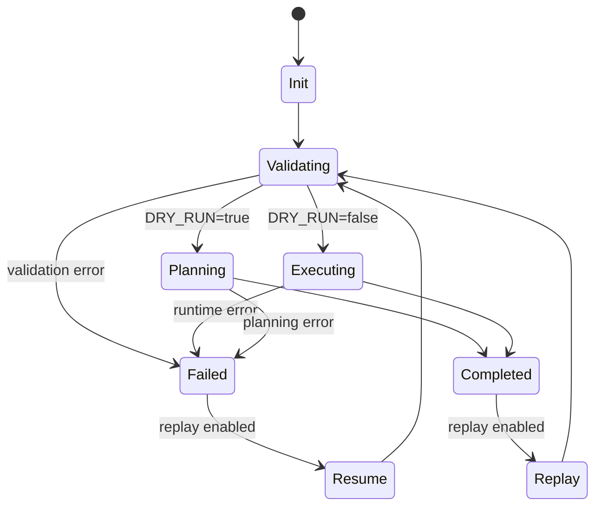

# Validation and errors – gates, matrix, and taxonomy

## Purpose
This document defines the validation gate model and how errors must be logged and handled. The objective is to prevent partial environments and make failures diagnosable and recoverable.

## config/validations.yml
Purpose: declarative gates that each command must pass before it can proceed.

Minimum gates to implement now:
- **proxmox_creds_present**: state/proxmox.env exists and required keys are set
- **secrets_present**: state/secrets.env exists if any app or module requires secrets
- **templates_present**: expected template artefacts exist in state/cache/templates
- **terraform_ready**: proxmox/terraform exists, providers init-able, state/cache/terraform writable
- **ansible_ready**: proxmox/ansible exists, ansible.cfg present, inventory present

## Validation matrix
| Command | proxmox_creds_present | templates_present | terraform_ready | ansible_ready | secrets_present |
|--------|-----------------------|-------------------|-----------------|---------------|-----------------|
| menu.sh | – | – | – | – | – |
| profiles.sh | – | – | – | – | – |
| apps_install.sh | optional | – | – | – | optional |
| apps_uninstall.sh | optional | – | – | – | optional |
| proxmox_access.sh | – | – | – | – | – |
| templates.sh | required | – | – | – | – |
| terraform_apply.sh | required | required | required | – | – |
| ansible_apply.sh | required | required | – | required | optional |
| diagnostics.sh | – | – | – | – | – |
| cleanup.sh | – | – | – | – | – |

## Run lifecycle state machine

## Logging and error taxonomy

### Log levels
- **INFO**: normal progress and state transitions
- **WARN**: non-fatal issues, degraded behaviour
- **ERROR**: step failure, execution stops

### Error classes
Recoverable errors:
- missing optional secrets
- failed dry run checks
- validation failures before execution

Fatal errors:
- Terraform apply failure
- Ansible execution failure
- corrupt or missing latest.env during replay

### Mandatory behaviours on error
All errors must:
- be logged to state/logs with RUN_ID
- update LAST_STEP_COMPLETED to the last successfully completed step
- return control to the menu safely with a remediation message
