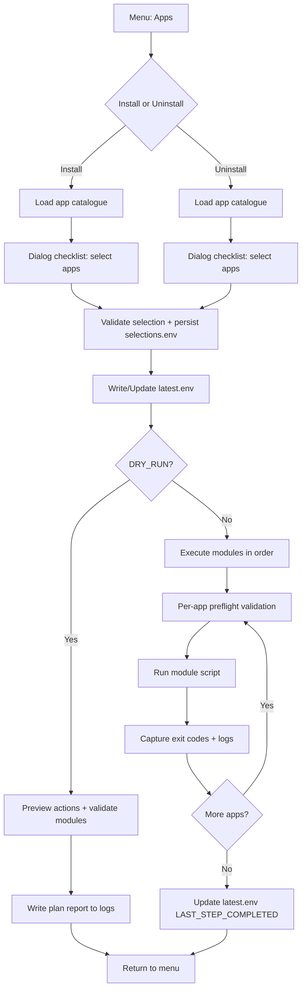

# Apps pipeline specification

## Purpose
Enable users to install or uninstall local applications either by selecting a profile or manually selecting apps.

Apps are defined in `config/apps.yml` and must map to module scripts under `modules/apps/`. The apps pipeline is the same regardless of whether selections originated from a profile or manual selection.

## Inputs
- `config/apps.yml` (catalogue)
- `config/profiles.yml` (if using profiles)
- `state/selections.env` (existing selections)
- `config/settings.env` (dry run toggle)
- optional `state/secrets.env` (if an app declares required secrets)

## Outputs
- `state/selections.env` updated with selected app IDs
- `state/runs/latest.env` updated for replay and run traceability
- `state/logs/<RUN_ID>/` contains per-step and per-app logging

## Selection and persistence
1. Load apps catalogue.
2. Render checklist (or profile selector).
3. Validate selection integrity:
   - all selected IDs exist in apps.yml
   - conflicts are not violated (apps.yml `conflicts`)
4. Persist selections to `state/selections.env`.
5. Update `state/runs/latest.env` with:
   - SELECTED_PROFILE (if applicable)
   - SELECTED_APPS_INSTALL and/or SELECTED_APPS_UNINSTALL
   - DRY_RUN
   - LAST_STEP_COMPLETED=apps_selection

## Execution model
- Deterministic ordering: alphabetical by app ID unless dependency ordering is introduced later.
- Before each module runs:
  - confirm module file exists
  - confirm required secrets exist (if declared)
  - optionally confirm required commands are present (for uninstall) or absent (for install) if you implement that optimisation

## Dry run behaviour
- Do not execute module scripts.
- Validate module existence and prerequisites.
- Produce a plan report listing:
  - selected apps
  - modules that would run
  - any missing prerequisites and remediation

## Module contract (modules/apps/*/<app>.sh)
- Must be idempotent.
- Must not prompt interactively (UI prompts happen via dialog).
- Must log to stdout/stderr (captured to state/logs).
- Must never print secrets.
- Should return non-zero only for actionable failures.

## Diagram: apps pipeline

