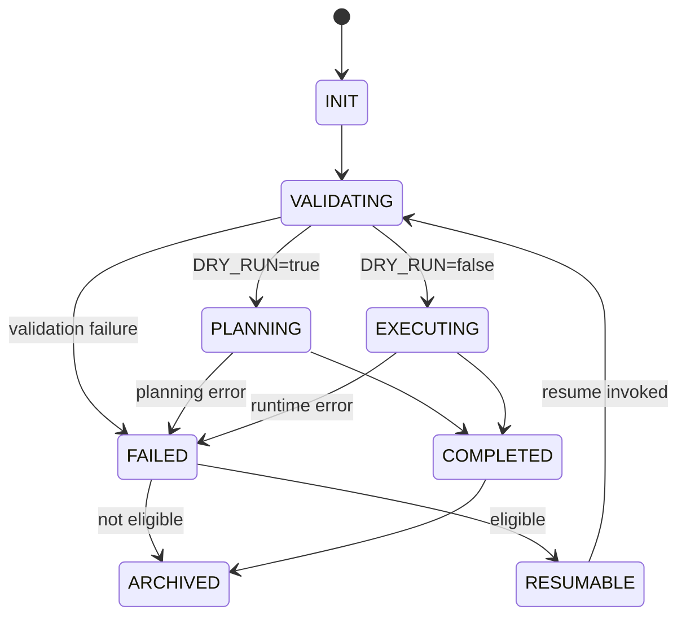

# Run lifecycle state machine and replay policy

Last updated: 2026-01-30

## Purpose
Define the exact run lifecycle for **every** command execution, including success, failure, dry run, replay, and resume semantics. This removes ambiguity for implementers and ensures runs are reproducible.

This spec is normative. Implementations must follow it.

## Key definitions
- **Run**: a single user-initiated action from the menu (including replayed actions).
- **RUN_ID**: unique identifier for a run; one per action, not one per session.
- **Step**: an internal sub-stage within a command (e.g., validate → plan → apply).
- **Artefact**: a file produced under `state/` that is used by later steps.

## Canonical run states
Each run must be in exactly one state at any point in time.

| State | Meaning | Allowed transitions |
|---|---|---|
| INIT | Run is created; metadata initialised | VALIDATING, FAILED |
| VALIDATING | Gates and pre-flight checks executing | PLANNING, EXECUTING, FAILED |
| PLANNING | Dry run or preview mode; no mutation allowed | COMPLETED, FAILED |
| EXECUTING | Live execution; mutation allowed | COMPLETED, FAILED |
| FAILED | Run ended unsuccessfully | RESUMABLE, ARCHIVED |
| RESUMABLE | Failure is eligible for resume | VALIDATING |
| COMPLETED | Run ended successfully | ARCHIVED |
| ARCHIVED | Terminal state; logs retained | none |

### State diagram

## Replay policy
Replay is a user-initiated action that reuses the last recorded intent and artefacts references from `state/runs/latest.env`.

### Preconditions
Replay is enabled only if:
1. `config/settings.env` contains `replay_enabled=true`
2. `state/runs/latest.env` exists and passes integrity checks (below)

### Integrity checks for latest.env
Replay must refuse (with remediation) if any of the following are true:
- `RUN_ID` missing
- `RUN_TIMESTAMP` missing
- `DRY_RUN` missing
- `LAST_STEP_COMPLETED` missing
- any referenced file path does not exist (for resume mode), for example `TERRAFORM_OUTPUT_JSON`
- any referenced app ID no longer exists in `config/apps.yml`

### Replay modes
| Mode | What it does | When to use |
|---|---|---|
| Replay from start | Re-runs the whole pipeline from the beginning using recorded selections | Homelab rebuilds, DR |
| Resume | Starts at the step after `LAST_STEP_COMPLETED` | Interrupted run |

### Resume semantics
Resume is only allowed if:
- The last run ended in FAILED or RESUMABLE, and
- The next step’s prerequisites still pass validation gates.

Resume starts at:
- `next_step(LAST_STEP_COMPLETED)` based on the pipeline ordering below.

Pipeline ordering for infra runs:
1. proxmox_access
2. templates
3. terraform_plan (dry run) or terraform_apply (live)
4. ansible_check (dry run) or ansible_apply (live)

### Replay safety rules
- Replay must always re-run VALIDATING before any PLANNING/EXECUTING.
- Replay must not re-use secrets from logs; secrets are only read from `state/proxmox.env` and `state/secrets.env`.
- Replay must re-render a confirmation screen showing:
  - profile
  - install apps
  - uninstall apps
  - DRY_RUN flag
  - last completed step
  - whether replay is from start or resume

## latest.env update rules
- latest.env is updated by **every command** that mutates state or is replayable.
- latest.env must never contain secret values.
- latest.env must be updated:
  - at INIT (create/update RUN_ID, RUN_TIMESTAMP, DRY_RUN)
  - after VALIDATING (record gate outcomes summary)
  - after each successful step (update LAST_STEP_COMPLETED)
  - on failure (record FAILURE_STEP and FAILURE_REASON; no secrets)

### Failure eligibility
A failed run is RESUMABLE if:
- failure occurred after a completed step boundary (i.e., LAST_STEP_COMPLETED exists), and
- required artefacts for resume are present.

Otherwise it is ARCHIVED only.
